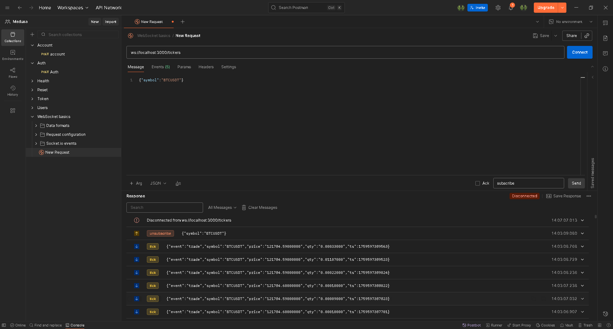

# 📡 NestJS Binance WebSocket Gateway

Este projeto é um **servidor NestJS** que conecta-se à **Binance WebSocket API** para transmitir dados de *cripto em tempo real* via **Socket.IO** para clientes conectados (front-end, Postman, ou outro serviço).

---

## 🧱 Estrutura

```cmd
API-WEBSOCKET:.
│   .env
│   .gitignore
│   .nvmrc
│   .prettierrc
│   eslint.config.mjs
│   nest-cli.json
│   package.json
│   README.md
│   tsconfig.build.json
│   tsconfig.json
│   yarn.lock
│
├───src
│   │   app.module.ts
│   │   main.ts
│   │
│   ├───modules
│   │   ├───health
│   │   │       health.controller.ts
│   │   │       health.module.ts
│   │   │
│   │   └───tickers
│   │           tickers.gateway.ts
│   │           tickers.module.ts
│   │
│   └───shared
│       └───api-externals
│           └───binance
│                   binance.module.ts
│                   binance.service.ts
```


### 🔹 TickersGateway
- Gerencia conexões de clientes via **Socket.IO**
- Eventos aceitos:
    - `subscribe` → inscreve-se em um símbolo (ex: BTCUSDT)
    - `unsubscribe` → cancela a inscrição
- Emite eventos:
    - `ready` → conexão inicial pronta
    - `subscribed` → confirmação de inscrição
    - `unsubscribed` → confirmação de cancelamento
    - `tick` → dados em tempo real de preço/quantidade

### 🔹 BinanceService
- Mantém **uma conexão WebSocket com a Binance por símbolo**
- Reutiliza conexões abertas (`refCount` para múltiplos clientes)
- Faz reconexão automática com *exponential backoff*
- Emite dados normalizados:
  ```json
  {
    "event": "trade",
    "symbol": "BTCUSDT",
    "price": "12345.67",
    "qty": "0.002",
    "ts": 1670000000000
  }
  ```

---

## ⚙️ Instalação

```bash
# Clonar o projeto
git clone <repo-url>
cd api-websocket

# Instalar dependências
yarn install

# Garantir libs necessárias
yarn add ws
yarn add -D @types/ws
# (opcional) se usar HttpModule:
# yarn add axios
```

---

## 🚀 Executar

```bash
yarn start:dev
```

Servidor padrão:
```
http://localhost:3000
```

---

## 🧪 Testar no Postman

1. Clique em **New → Socket.IO Request**
2. URL:
   ```
   ws://localhost:3000/tickers
   ```
3. Em **Events**, adicione e ative:
    - `ready`
    - `subscribed`
    - `unsubscribed`
    - `tick`
    - `error`

4. Clique **Connect**

5. Envie um evento:
    - **Event**: `subscribe`
    - **Message (JSON)**:
      ```json
      { "symbol": "BTCUSDT" }
      ```

6. Você deve começar a receber vários eventos `tick`.

7. Para parar:
    - **Event**: `unsubscribe`
    - **Message (JSON)**:
      ```json
      { "symbol": "BTCUSDT" }
      ```

---

## 🧩 Teste com cliente Node.js

```bash
yarn add socket.io-client
```

```js
import { io } from 'socket.io-client';

const socket = io('http://localhost:3000/tickers', { transports: ['websocket'] });

socket.on('ready', () => {
  console.log('✅ Conectado!');
  socket.emit('subscribe', { symbol: 'BTCUSDT' });
});

socket.on('subscribed', (msg) => console.log('subscribed', msg));
socket.on('tick', (tick) => console.log('tick', tick));
socket.on('unsubscribed', (msg) => console.log('unsubscribed', msg));
socket.on('error', (err) => console.error('error', err));

// cancelar depois de 10 segundos
setTimeout(() => socket.emit('unsubscribe', { symbol: 'BTCUSDT' }), 10000);
```

---

## 🧠 Conceito de funcionamento

| Etapa | Descrição |
|-------|------------|
| 1️⃣ | Cliente se conecta ao namespace `/tickers` via Socket.IO |
| 2️⃣ | Envia `subscribe` com `{ symbol }` |
| 3️⃣ | O servidor cria (ou reutiliza) uma conexão WebSocket para aquele símbolo na Binance |
| 4️⃣ | Dados recebidos da Binance são reemitidos como evento `tick` para todos os clientes inscritos |
| 5️⃣ | Quando o cliente envia `unsubscribe`, a inscrição é removida (e a conexão fechada se ninguém mais usa) |

---

## 🧰 Exemplos de símbolos

| Símbolo | Descrição |
|----------|------------|
| `BTCUSDT` | Bitcoin / Tether |
| `ETHUSDT` | Ethereum / Tether |
| `BNBUSDT` | Binance Coin / Tether |
| `SOLUSDT` | Solana / Tether |

---

## 👨‍💻 Author

<div align="center">
  

**Rodrigo Rangel**

  <div>
    <a href="https://hangell.org" target="_blank">
      
    </a>
    <a href="https://play.google.com/store/apps/dev?id=5606456325281613718" target="_blank">
      
    </a>
    <a href="https://www.youtube.com/channel/UC8_zG7RFM2aMhI-p-6zmixw" target="_blank">
      
    </a>
    <a href="https://www.facebook.com/hangell.org" target="_blank">
      
    </a>
    <a href="https://www.linkedin.com/in/rodrigo-rangel-a80810170" target="_blank">
      
    </a>
  </div>
</div>

---

## 🧾 Licença

MIT © 2025 — Feito com 💻 e ☕
